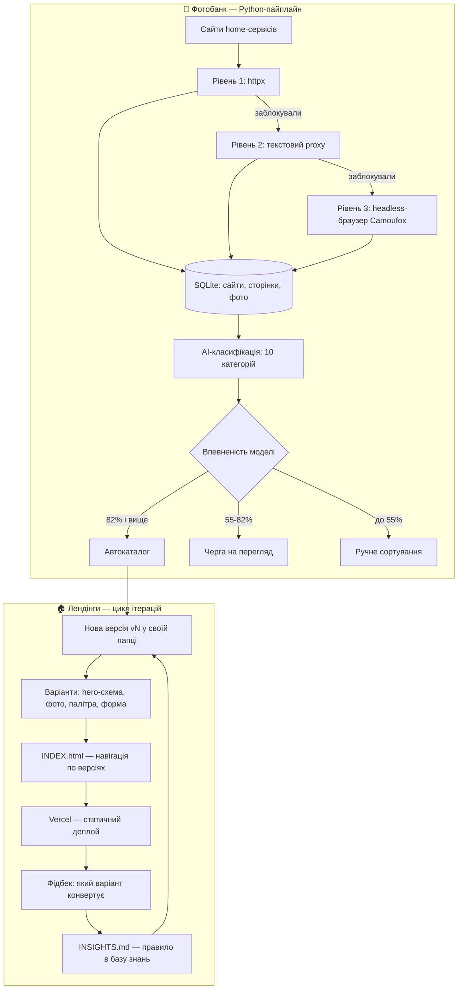

# Home IQ — ітеративні лендінги для home services

Портфоліо лендінгів для лідогенерації в домашніх послугах (США): одна ніша — 11 версій сторінки, нуль кроків білду, плюс Python-пайплайн для збору й класифікації фотобанку.

> **TL;DR (EN):** Build-free HTML/CSS/JS landing pages for US home-services lead generation, iterated as 11 versioned design variants (v2–v5) with a written-down design-rules file, plus a local Python pipeline that crawls home-service sites and AI-classifies a 2,200+ photo bank. Deployed as static files on Vercel.

## Що це таке, простими словами?

Уяви торгову вулицю, де в одного магазину — десяток вітрин підряд. Товар усюди той самий, але кожна вітрина оформлена інакше: тут велике фото і одна кнопка, там інша палітра, ще далі — форма замовлення збоку, а не поверх фото. Стоїш і рахуєш, у які двері заходить більше людей.

Цей репозиторій — така вулиця, тільки для *лендінгів* — односторінкових сайтів, куди людина потрапляє з реклами і залишає заявку (*лід* — контакт потенційного клієнта, за який платить бізнес). Кожна версія сторінки живе у власній папці й відкривається без жодної збірки, тому порівняти дві «вітрини» можна двома вкладками браузера. Що спрацювало, а що ні — записується у файл правил, і наступна версія стартує вже розумнішою. А в підсобці — Python-інструмент, який сам обходить сайти домашніх сервісів, збирає фото і розкладає їх по полицях: «це на вітрину», «це продукт», «це брак».



## Можливості

- 11 версій лендінгу home-security у 4 поколіннях (v2–v5): 4 схеми hero (side-by-side, fullbleed, split 50/50, dark card), 3 варіанти головного фото, 2 палітри (teal і blue).
- Кожна сторінка самодостатня: HTML із inline CSS та vanilla JS, без фреймворків і бандлерів — відкривається з будь-якого статичного сервера.
- Mobile-first: hero розрахований на один екран (`min-height: calc(100vh - 70px)`), фото на мобайлі — edge-to-edge, без рамок і тіней.
- База знань дизайну: `INSIGHTS.md` з 8 правилами, виведеними з ітерацій — наприклад «hero = 1 фото + 1 заголовок + 1 CTA» і «форма ніколи не перекриває hero-фото».
- Навігація і історія: `INDEX.html` зі списком усіх версій, `CHANGELOG.md` з хронологією рішень.
- Фотобанк: ~2 261 фото із 7 сайтів однієї ніші, 10 категорій (hero, product, lifestyle, installation тощо), маршрутизація за впевненістю: 82%+ — автокаталог, 55–82% — на перегляд, менше 55% — вручну.
- Vercel-конфіг: security-заголовки (nosniff, SAMEORIGIN, referrer-policy) та річний immutable-кеш для зображень (`Cache-Control: max-age=31536000`).

## Вертикалі

Структура розрахована на 13 вертикалей: `home-security` (активна, 11 версій лендінгів), а також `roofing`, `flooring`, `siding`, `hvac`, `walk-in-shower`, `solar`, `gutters`, `kitchen`, `plumbing`, `home-warranty`, `walk-in-tubs`, `pest-control` — для них підготовлені папки, шаблони брифів і референсів.

## Структура

```
.
├── _playbook/                  # універсальні принципи копірайтингу
├── _templates/                 # шаблони: landing, brief, reference
├── _tools/
│   └── homeiq-photobank/       # Python: збір і AI-класифікація фото
├── scripts/                    # convert-images.py, reencode-hero-images.py
├── verticals/
│   └── [slug]/
│       ├── brief.md            # аудиторія і меседжинг вертикалі
│       ├── references/         # конкурентний аналіз
│       └── landings/
│           ├── INDEX.html      # навігація по всіх версіях
│           ├── INSIGHTS.md     # правила дизайну, виведені з фідбеку
│           ├── CHANGELOG.md
│           ├── _shared/        # privacy, terms, contact
│           └── v{N}-{name}/    # одна самодостатня версія = одна папка
│               ├── index.html
│               └── images/
├── index.html
└── vercel.json                 # заголовки і кеш
```

Конвенція іменування версій: `v{N}-{descriptor}` — головна версія, `v{N}{letter}-{descriptor}` — варіант тієї ж версії (інше фото, інший trust bar).

## Чому це цікаво технічно

- «Папка = версія»: кожен експеримент форкається копіюванням директорії і ніколи не перезаписує робочу версію. Git тримає історію, файлова структура — простір варіантів; порівняння A і B — це дві вкладки браузера, без гілок і чері-піків.
- Свідома відмова від збірки: без фреймворків сторінка вантажиться одним HTML-запитом плюс фото. Ціна — дублювання CSS між версіями, і тут вона прийнятна: версії мають розходитись, а не синхронізуватись.
- Фетчер фотобанку ескалує за три рівні: прямий `httpx` (швидко й дешево) → текстовий proxy (коли блокують) → headless-браузер Camoufox (крайній випадок). Дешеві методи першими — менше часу на сайт і менше банів.
- AI-класифікатор (Gemini 2.5 Flash через OpenRouter) не має права останнього слова: пороги впевненості розводять фото в автокаталог / чергу перегляду / ручне сортування. Точність виміряна по категоріях (exterior ~100%, product ~90%, installation ~60%) — ручна черга існує не «про всяк випадок», а під конкретні слабкі категорії.

## Як запустити

### Лендінги

Потрібен лише Python (для локального статичного сервера):

```bash
git clone https://github.com/SerhiiDubei/home-iq.git
cd home-iq/verticals/home-security/landings
python -m http.server 8090
```

Відкрити `http://localhost:8090/INDEX.html` — це навігація по всіх версіях.

Живий деплой: `https://home-iq-dusky.vercel.app/verticals/home-security/landings/INDEX.html`

### Фотобанк

```bash
cd _tools/homeiq-photobank
python -m venv venv
venv\Scripts\activate          # Windows; на macOS/Linux: source venv/bin/activate
pip install -r requirements.txt
```

Для класифікації потрібен ключ OpenRouter (див. `config.yaml`). Основні команди:

```bash
python -m homeiq.cli.discover_sites   # знайти схожі сайти ніші
python -m homeiq.cli.crawl_site       # обійти один сайт і зібрати фото
python -m homeiq.cli.classify_photos  # AI-класифікація зібраного
pytest                                # тести (pytest.ini у корені тулу)
```

На Windows є обгортки `discover.bat` / `crawl.bat` / `classify.bat` — ті самі команди через `venv`.

### Деплой

Vercel, статичний хостинг без білд-кроку — конфігурація в `vercel.json`.

## Стан проекту

**Працює:**
- home-security: 11 версій, навігація через `INDEX.html`, задеплоєно на Vercel;
- фотобанк: повний цикл discover → crawl → classify, датасет ~2 261 фото;
- скрипти конвертації зображень у `scripts/`.

**Прототип:**
- фотобанк покриває одну нішу (security) із запланованих; точність класифікації нерівномірна — категорія installation дає лише ~60%;
- `.bat`-обгортки розраховані на Windows-розкладку venv.

**Чого нема:**
- лендінгів для решти 12 вертикалей — поки що тільки структура папок і шаблони;
- аналітики конверсій у репо: вимірювання варіантів відбувається на стороні трафіку, репозиторій зберігає самі варіанти і висновки в `INSIGHTS.md`;
- CI та автотестів для фронтенд-частини (тести є лише у фотобанку).
